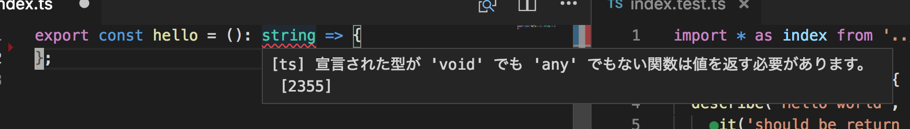
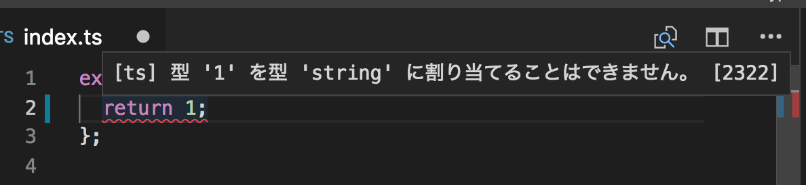

<style type="text/css">
<!--
.reveal h2 {
    text-transform: none;
    font-size: 42px;
}
.reveal p { font-size: 30px; }
.reveal ul li { font-size: 30px; }
-->
</style>

## TypeScript TDD トレーニング 01

オリエンテーション, 型

---

## 目次

- 今日のポイント
- TypeScriptのテスト環境
- 基本型と演算子
  - 特殊な型
- なぜTypeScriptか？
- クイックTDD
- まとめ

---

## 今日のポイント

- TypeScriptを利用したテスト環境を理解すること
- なぜTypeScriptでやるか理解すること
- 基本型をTDDを通して学ぶこと

---

## TypeScriptのテスト環境

- [テスト環境](https://github.com/ababup1192/tdd-typescript-env)


---

## 基本型と演算子

数値(`number`)型。整数も小数も表す。四則演算子が使える。

```javascript
> 1234
1234
> 1.5
1.5
> 1 + 2 - (2 * 1.5)
0
> 1234 / 1.2
1028.3333333333335
> 10 / 2
5
```

---

## 基本型と演算子

文字列(`string`)型。シングルクォートもしくは、ダブルクォートで記述。+演算子で連結可能。バッククォートを利用することで式を展開することが可能。

```javascript
> "abcdefg"
'abcdefg'
> '<p id="foo">hello</p>'
'<p id="foo">hello</p>'
> '1 + 1 = ' + (1+1) + 'です。'
'1 + 1 = 2です。'
> `1 + 1 = ${1+1}です。`
'1 + 1 = 2です。'
> const str = '中身'
> `変数strの${str}`
'変数strの中身'
```

---

## 基本型と演算子

文字列はいくつかの便利なメソッド(自身が持っている関数)を持っています。

```javascript
> 'abcdef'.length
6
> 'abcdef'.substr(1, 3) // 部分文字列
'bcd'
> 'I love cat.'.replace('cat', 'dog')
'I love dog.'
```

---

## 基本型と演算子

真偽値(`bool`)型。論理型とも呼ばれる。論理演算子(&&, ||, !)を用いて扱う。

```javascript
> true
true
> false
false
> true && false // AかつB
false
> true || false // AもしくはB
true
> !true // 否定
false
```

---

## 基本型と演算子

比較演算子を使うことで、bool型を返す。

```javascript
> 1 < 2 // 1は2より小さい
true
> 3 <= 3 // 3は3以上
true
> 'abc' === 'abc' 
true
> 'cat' !== 'dog'
true
> 1 == '1' // 型を考慮しない比較
true
> 1 === '1' // 型を考慮した比較
false
```

---

## 特殊な型

- undefined 
    - まだ値が代入されていない変数は undefined
    - 評価しようとしている変数に値が代入されていない場合、メソッドや文も undefined を返す
    - 値を return しない関数も undefined を返す
- void
    - 値を返さない関数の戻り型を表す
- any
    - どんな型でも当てはまる型を表す

---

## なぜTypeScriptか？

型が一致しているかどうかを検知するには、テストよりもコンパイラ(TypeScript)に任せるほうがフィードバックが早く得られ、安全である。




---

## クイックTDD

- 男('man')か？
- 年齢が大人(18歳以上)かどうか？
- ２つの数字の和
- ２つの文字列を繋げる
- '私は次の誕生日で、12歳です。'
- ２つの数字の商
- 文字列の長さ
- 頭と末尾の文字を削る

---

## まとめ

- テストは「関数」対象に振る舞いを確認する
- TypeScriptは「型」と言う制約を設けることで間違いを減らし開発を円滑にする
- 基本型は演算子を用いることで演算することが可能

---

## 参考文献

- [TypeScript (Basic Types)](https://www.typescriptlang.org/docs/handbook/basic-types.html)
- [MDN 標準ビルトインオブジェクト](https://developer.mozilla.org/ja/docs/Web/JavaScript/Reference/Global_Objects)
- [JestJS](https://jestjs.io)