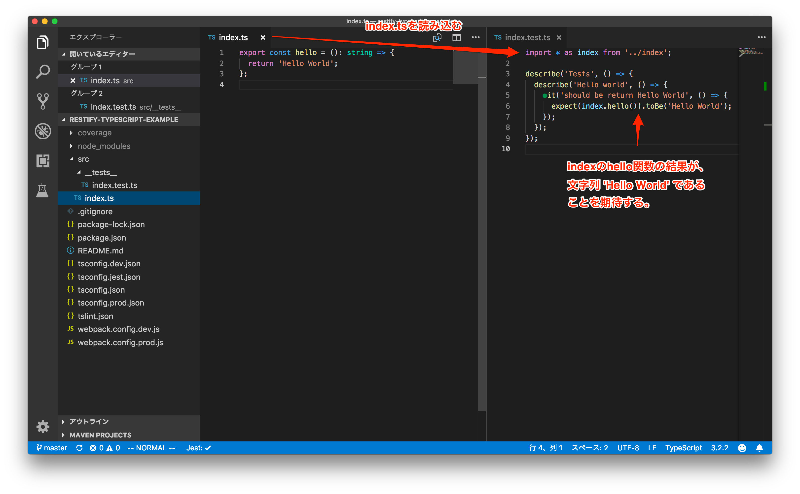

## TypeScript TDD トレーニング 01

オリエンテーション, 型

---

## 目次

- 今日のポイント
- TypeScriptのテスト環境
- クイックTDD
- まとめ

---

## 今日のポイント

- TypeScriptを利用したテスト環境を理解すること
- なぜTypeScriptでやるか理解すること
- 基本型をTDDを通して学ぶこと

---

## TypeScriptのテスト環境

- [テスト環境](https://github.com/ababup1192/tdd-typescript-env)

---

## クイックTDD

- 男('man')か？
- 年齢が大人(18歳以上)かどうか？
- ２つの数字の和
- ２つの文字列を繋げる
- '私は次の誕生日で、12歳です。'
- ２つの数字の商
- 文字列の長さ
- 頭と末尾の文字を削る

---

## まとめ

- テストは「関数」対象に振る舞いを確認する
- TypeScriptは「型」と言う制約を設けることで間違いを減らし開発を円滑にする
- 基本型は演算子を用いることで演算することが可能
